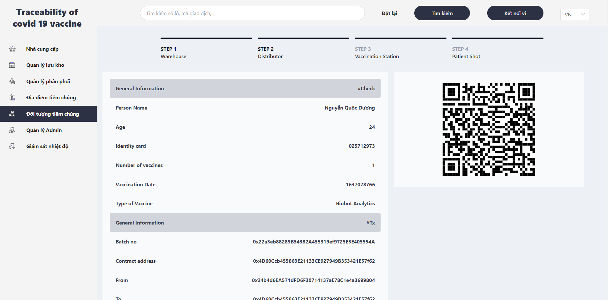

<h1 align="center">
   
  
   
  Traceability of Covid-19 Vaccine (Decentralized Application)
   
</h1>

<h4 align="center">A traceability of covid 19 vaccine system.</h4>

[Figma Design - Traceability of Covid-19 Vaccine System](https://www.figma.com/file/pIQ6FSknJ8BG7iwP7oYmUi/Khoaluantotnghiep?node-id=0%3A1)
 
[Video Demo](https://drive.google.com/file/d/1ew1Gae4bZBA8EKxSvlpPJt_wlLd0zteS/view?usp=sharing)
-----
<h1 align="center">High level architecture</h1>

-----

 

  <h1 align="center">1. Producer Flow</h1>
  
  
Image 1.1 Dashboard (producer)

   

  
  
Image 1.2 Create batch no of vaccine

   

  
  
Image 1.3 Connect Wallet Success

   

  
  
Image 1.4 Producer Details

   

 

  <h1 align="center">2. Warehouser Flow</h1>
  
  
Image 2.1 Dashboard (warehouse)

   

  
  
Image 2.2 Import new batch no of vaccine

   

  
  
Image 2.3 Warehouse Details

   

 

  <h1 align="center">3. Distributor Flow</h1>
  
  
Image 3.1 Dashboard (distributor)

   

  
  
Image 3.2 Distribute a batch of vaccines

   

  
  
Image 3.3 Distribute Details

   

 

  <h1 align="center">4. Vaccination Station Flow</h1>
  
  
Image 4.1 Dashboard

   

  
  
Image 4.2 Receive a batch of vaccines

   

  
  
Image 4.3 Vaccination Station Details

   

 

  <h1 align="center">5. Patient Flow</h1>
  
  
Image 5.1 Dashboard

   

  
  
Image 5.2 Add new Patient

   

  
  
Image 5.3 Patient details

   

